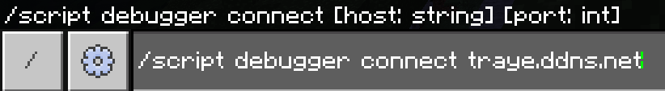

# Hive Mind Debugger

This is what's going on the server when you connect using the [api](https://github.com/TrayePlays/Hive-Mind-Api-Public).

# WARNING
If you intend to post / share the mod. Please encrypt / obfuscate your key otherwise the downloader will be able to see it.
Also for the debugger it's not encrypted. Send data carefully!

# Connecting

You are first going to need to connect to Hive Mind.
There are 2 ways:

## 1. Automatically:
- ### Open your settings > creator and put this in

## 2. Manually: 
- ### When in game type:

# How I made this

The basis of this project is from [Mojang's Debugger](https://github.com/Mojang/minecraft-debugger). I directly use some of their code in here.
